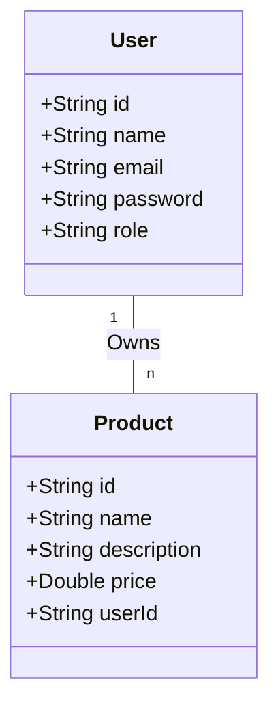

# Let's Play — RESTful CRUD API

**Let's Play** is a secure, scalable RESTful CRUD API built with **Spring Boot** and **MongoDB**. The application manages users and products, supporting complete CRUD operations, token-based **JWT authentication**, role-based access control (**Admin** vs. **User**), **BCrypt** password security, global exception handling, **Rate Limiting**, and **CORS**.

---

## 🛠️ Technologies Used

- **Java Development Kit**: Java 17+ (Java 25 compatible)
- **Framework**: Spring Boot 3.3.5
- **Database**: **MongoDB 7.0** via `spring-boot-starter-data-mongodb` (managed via Docker Compose)
- **Security & Authorization**:
  - **Spring Security 6**
  - **JSON Web Tokens (JWT)**: `io.jsonwebtoken:jjwt` v0.12.5
  - **Password Hashing**: BCrypt (`BCryptPasswordEncoder`)
- **Boilerplate Reduction**: Project Lombok (`@Data`, `@Builder`, `@RequiredArgsConstructor`, `@Getter`, etc.)
- **Validation**: Jakarta Bean Validation (`@NotNull`, `@NotBlank`, `@Email`, `@Size`, `@Min`)
- **Testing**: JUnit 5, Spring Boot Test, Spring Security Test, MockMvc
- **Build Tool**: Apache Maven (via `./mvnw` wrapper)
- **Task Automation**: `Makefile`
- **Frontend Test Client**: HTML5 / JavaScript (`test-client.html`)

---

## 📐 Entity Architecture



---

## 🔑 Environment Configuration (`.env`)

The project imports secrets and configurations directly from [`.env`](file:///home/amines/Desktop/lets-play/.env):

```properties
# Server Port
SERVER_PORT=8080

# JWT Authentication Credentials & Secrets
JWT_SECRET=404E635266556A586E3272357538782F413F4428472B4B6250645367566B5970
JWT_EXPIRATION=86400000

# MongoDB Configuration
SPRING_DATA_MONGODB_HOST=localhost
SPRING_DATA_MONGODB_PORT=27017
SPRING_DATA_MONGODB_DATABASE=letsplaydb
```

---

## 🚀 Getting Started

### Prerequisites
- Java 17 or higher (or Docker)
- Docker & Docker Compose
- Make (optional, for shortcut commands)

### Running the Application

#### Option 1: Full Stack via Docker Compose
Run the entire stack (Backend + MongoDB container) with a single command:

```bash
make compose-up
# or: docker compose up -d
```

To view logs or stop the stack:
```bash
make compose-logs   # docker compose logs -f
make compose-down   # docker compose down
```

#### Option 2: Running Backend Locally with Dockerized MongoDB
Start the MongoDB container, then launch the Spring Boot application:

```bash
# 1. Start MongoDB container
make db-up          # docker compose up -d mongodb

# 2. Run Spring Boot application locally
make run            # or inside backend: ./mvnw spring-boot:run
```

The server starts on `http://localhost:8080`.

---

## 🧪 Testing

### Running Automated Integration Tests
Run all unit and integration tests with:

```bash
make test
```

### Manual Testing with Interactive Web Client
Open [`test-client.html`](file:///home/amines/Desktop/lets-play/test-client.html) directly in your browser to test endpoints visually.

---

## 📡 API Endpoints Summary

### Authentication (`/auth`)
| Method | Endpoint | Access | Description |
| :--- | :--- | :--- | :--- |
| `POST` | `/auth/register` | Public | Register a new user |
| `POST` | `/auth/login` | Public | Authenticate user & get JWT token |

### Products (`/products`)
| Method | Endpoint | Access | Description |
| :--- | :--- | :--- | :--- |
| `GET` | `/products` | Public | Retrieve all products |
| `GET` | `/products/{id}` | Public | Retrieve product by ID |
| `POST` | `/products` | Authenticated | Create a new product |
| `PUT` | `/products/{id}` | Owner or Admin | Update an existing product |
| `DELETE` | `/products/{id}` | Owner or Admin | Delete a product |

### Users (`/users`)
| Method | Endpoint | Access | Description |
| :--- | :--- | :--- | :--- |
| `GET` | `/users` | Admin Only | List all registered users |
| `GET` | `/users/{id}` | Admin or Self | Retrieve user details by ID |
| `POST` | `/users` | Admin Only | Create a user |
| `PUT` | `/users/{id}` | Admin or Self | Update user details |
| `DELETE` | `/users/{id}` | Admin Only | Delete user |

---

## ⚙️ Available Makefile Commands

- `make run` — Start the Spring Boot backend server locally
- `make test` — Execute all unit & integration tests
- `make build` — Build application package JAR
- `make clean` — Remove build output directory
- `make compose-up` — Start backend and MongoDB stack via Docker Compose
- `make compose-down` — Stop Docker Compose stack
- `make compose-logs` — Follow logs of Docker Compose stack
- `make help` — Show help overview
