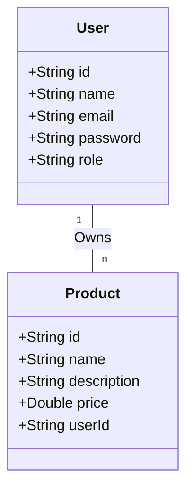

# Let's Play RESTful CRUD API

A secure, robust, and scalable backend RESTful CRUD API called **Let's Play**, built using **Spring Boot** and **MongoDB**. The system manages **Users** and **Products** (with a one-to-many relationship) and enforces token-based security using **Spring Security** and **JSON Web Tokens (JWT)**.

---

## 🚀 Key Features & Implementation Details

1. **Database Design**:
   - Implements a clean one-to-many relationship where each `User` can own multiple `Product` entries.
   - Designed MongoDB collections (`users` and `products`) mapped using Spring Data annotations.

2. **Authentication & Authorization**:
   - **JWT Authentication**: Token-based security using the `io.jsonwebtoken` library. Users register/log in and receive a stateless token to authenticate subsequent requests.
   - **Role-Based Access Control (RBAC)**:
     - **Admin**: Has administrative rights to manage all users and products.
     - **User**: Standard user who can register, login, view products, create products, and only edit/delete their own products.
     - **Public**: Unauthenticated guests can view all products.

3. **Security Standards**:
   - **BCrypt Password Hashing**: Hashing and salting passwords using BCrypt before storing them.
   - **Input Validation & Injection Prevention**: Strictly validates requests (using `@NotBlank`, `@Email`, etc.) to prevent malformed payloads or MongoDB injection attacks.
   - **Sensitive Data Sanitization**: Excludes fields like passwords from all REST JSON responses via clean Data Transfer Objects (DTOs).

4. **Robust Error Handling**:
   - Standardized JSON error response structure.
   - Zero unhandled 5XX HTTP responses.
   - Maps standard security and validation exceptions to clear HTTP codes (e.g. 400 Bad Request, 401 Unauthorized, 403 Forbidden, 404 Not Found, 409 Conflict, and 429 Too Many Requests).

5. **Bonus Features**:
   - **CORS Configuration**: Fine-grained Cross-Origin Resource Sharing policies allowing flexible cross-origin requests.
   - **Rate Limiting Filter**: Protects the API by limiting requests per IP address (default: 60 requests per minute), returning 429 Too Many Requests when exceeded.

---

## 🛠️ Technology Stack

- **Java**: Version 17
- **Framework**: Spring Boot (v4.1.0) & Spring Security
- **Database**: MongoDB (latest)
- **JSON Handler**: Jackson Databind
- **Build Tool**: Maven Wrapper (`mvnw`)
- **Containers**: Docker & Docker Compose (for MongoDB)

---

## 🗃️ Database Relationship



---

## 📂 API Endpoints Map

### 1. Authentication (`/auth`)
| Method | Endpoint | Access | Description |
| :--- | :--- | :--- | :--- |
| `POST` | `/auth/register` | Public | Register a new User or Admin. Returns a JWT token. |
| `POST` | `/auth/login` | Public | Authenticate a user with email and password. Returns a JWT token. |

### 2. Products (`/products`)
| Method | Endpoint | Access | Description |
| :--- | :--- | :--- | :--- |
| `GET` | `/products` | Public | Get all products. |
| `GET` | `/products/{id}` | Public | Get a single product by ID. |
| `POST` | `/products` | Authenticated | Create a new product. Owner becomes the current user. |
| `PUT` | `/products/{id}` | Owner or Admin | Update a product's details. |
| `DELETE` | `/products/{id}` | Owner or Admin | Delete a product. |

### 3. Users (`/users`)
| Method | Endpoint | Access | Description |
| :--- | :--- | :--- | :--- |
| `GET` | `/users` | Admin Only | Get all users list (without passwords). |
| `GET` | `/users/{id}` | Admin Only | Get details of a single user. |
| `POST` | `/users` | Admin Only | Provision a new user. |
| `PUT` | `/users/{id}` | Admin Only | Update details of a user. |
| `DELETE` | `/users/{id}` | Admin Only | Delete a user (cascade deletes their owned products). |

---

## ⚙️ Quick Start Instructions

### 1. Prerequisites
- Docker & Docker Compose
- Java 17

### 2. Run MongoDB
Start the MongoDB container in the background:
```bash
docker compose up -d
```

### 3. Build & Run Application
Use the Maven Wrapper to build and start the application locally:
```bash
./mvnw clean spring-boot:run
```
The API server will launch on port `8080`.

### 4. Run Tests
Verify all 11 integration tests covering JWT validation, CRUD access controls, error handlers, and rate-limiting:
```bash
./mvnw test
```

---

## 🚫 Standard Error Response Schema

When an API request fails, a consistent JSON body is returned:

```json
{
  "timestamp": "2026-08-03T15:26:04.912",
  "status": 403,
  "error": "Forbidden",
  "message": "You do not have permission to access this resource",
  "path": "/users"
}
```

If validation fails on DTO fields (e.g. invalid email format or empty name):

```json
{
  "timestamp": "2026-08-03T15:27:01.123",
  "status": 400,
  "error": "Bad Request",
  "message": "Validation failed",
  "details": [
    "email: Invalid email format",
    "password: Password must be at least 6 characters long"
  ],
  "path": "/auth/register"
}
```
