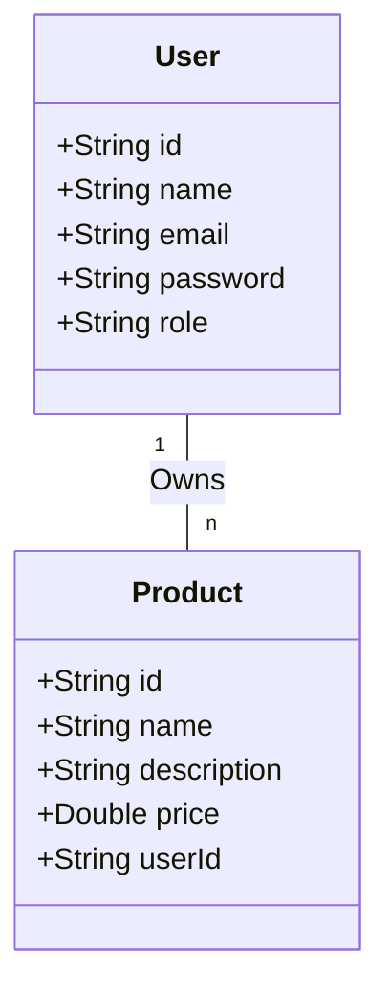

# Let's Play — RESTful CRUD API

[](https://www.oracle.com/java/)
[](https://spring.io/projects/spring-boot)
[](https://www.mongodb.com/)
[](https://spring.io/projects/spring-security)
[](https://jwt.io/)

**Let's Play** is a secure, scalable RESTful CRUD API designed for a modern e-commerce platform. Built with **Spring Boot** and **MongoDB**, it provides complete resource management for users and products with token-based **JWT authentication**, granular **Role-Based Access Control (RBAC)**, **BCrypt** password hashing, comprehensive **Global Exception Handling**, IP-based **Rate Limiting**, and strict **CORS** security.

---

## 📑 Table of Contents

- [Architectural Overview](#-architectural-overview)
- [Technologies & Dependencies](#-technologies--dependencies)
- [Entity & Database Design](#-entity--database-design)
- [Getting Started](#-getting-started)
  - [Prerequisites](#prerequisites)
  - [Running with Docker Compose](#option-1-full-stack-via-docker-compose-recommended)
  - [Running Backend Locally](#option-2-running-backend-locally-with-dockerized-mongodb)
- [Manual Testing via Web Client](#-manual-testing-via-web-client)
- [Security & Architecture Features](#-security--architecture-features)
- [📘 API Documentation & Endpoint Reference](#-api-documentation--endpoint-reference)
  - [Global Conventions & Error Format](#global-conventions--error-format)
  - [1. Authentication Endpoints (`/auth`)](#1-authentication-endpoints-auth)
  - [2. Products Endpoints (`/products`)](#2-products-endpoints-products)
  - [3. Users Endpoints (`/users`)](#3-users-endpoints-users)
- [Makefile Automation Reference](#-makefile-automation-reference)

---

## 🏗️ Architectural Overview

The application follows a clean 4-tier layered architecture adhering to the Single Responsibility Principle:

```
[ HTTP Client / Frontend ]
          │
          ▼
[ Security Filter Chain ] ─── (RateLimitingFilter, JwtAuthenticationFilter, CORS)
          │
          ▼
[ Controller Layer ]      ─── (AuthController, ProductController, UserController)
          │
          ▼
[ Service Layer ]         ─── (AuthService, ProductService, UserService)
          │
          ▼
[ Repository Layer ]      ─── (UserRepository, ProductRepository -> Spring Data MongoDB)
          │
          ▼
[ Database ]              ─── (MongoDB Document Store)
```

---

## 🛠️ Technologies & Dependencies

- **Language & Runtime**: Java 17+ (Java 21 / 25 compatible)
- **Core Framework**: Spring Boot `3.3.5` (`spring-boot-starter-web`)
- **Persistence Engine**: MongoDB 7.0 via `spring-boot-starter-data-mongodb` (NoSQL, document-oriented)
- **Security Framework**: Spring Security 6 (`spring-boot-starter-security`)
- **Token Management**: JJWT (`io.jsonwebtoken:jjwt` v0.12.5) with HMAC-SHA256 signing
- **Data Validation**: Jakarta Bean Validation (`@NotNull`, `@NotBlank`, `@Email`, `@Size`, `@Min`)
- **Code Optimization**: Project Lombok (`@Data`, `@Builder`, `@RequiredArgsConstructor`, etc.)
- **Testing**: JUnit 5, Spring Boot Test, Spring Security Test, MockMvc
- **Build & Packaging**: Apache Maven (`./mvnw`)
- **Orchestration**: Docker & Docker Compose
- **Command Automation**: GNU Makefile

---

## 📐 Entity & Database Design

The database model implements a **One-to-Many relationship** between `User` and `Product`. Each user can own multiple products, while each product is assigned to a single owning user ID.



### Entity Specifications

#### 1. `User` Entity (`users` collection)
- `id` (`String`): Unique document identifier (MongoDB ObjectId string).
- `name` (`String`): User's full name (2–50 characters, non-blank).
- `email` (`String`): Unique email address with a MongoDB unique index (`@Indexed(unique = true)`).
- `password` (`String`): Securely hashed via BCrypt. Marked with `@JsonIgnore` to prevent serialization.
- `role` (`String`): User role classification (`ADMIN` or `USER`).

#### 2. `Product` Entity (`products` collection)
- `id` (`String`): Unique product document identifier.
- `name` (`String`): Product name (2–100 characters, non-blank).
- `description` (`String`): Detailed product description (non-blank).
- `price` (`Double`): Monetary price (`>= 0.0`).
- `userId` (`String`): Foreign identifier referencing the owning `User.id` (indexed for query performance).

---

## 🚀 Getting Started

### Prerequisites
- **Java Development Kit (JDK)**: Version 17 or higher
- **Docker & Docker Compose**: Installed and running
- **Make**: (Optional, for simplified terminal commands)

---

### Option 1: Full Stack via Docker Compose (Recommended)

Start the entire application stack (Spring Boot Backend + MongoDB 7.0 Container):

```bash
make compose-up
# Alternatively:
docker compose up -d
```

View live logs:
```bash
make compose-logs
```

Stop the stack:
```bash
make compose-down
```

---

### Option 2: Running Backend Locally with Dockerized MongoDB

1. **Start the MongoDB database container**:
   ```bash
   make db-up
   # Alternatively: docker compose up -d mongodb
   ```

2. **Launch the Spring Boot backend**:
   ```bash
   make run
   # Alternatively: cd backend && ./mvnw spring-boot:run
   ```

The REST API server will start and listen on `http://localhost:8080`.

---

## 🧪 Testing & Quality Assurance

### Automated Integration Tests
The repository includes automated test suites covering authentication, role-based access control (RBAC), product ownership isolation, cascade deletion, rate limiting, and global exception handling:

```bash
make test
# Alternatively: cd backend && ./mvnw test
```

### Interactive Web Test Client
An interactive frontend test client is included. Simply open `test-client.html` in your web browser:
- Register and log in users (User and Admin roles).
- Execute authenticated/unauthenticated API calls.
- Inspect JSON responses, HTTP status codes, and JWT headers visually.

---

## 🔒 Security & Architecture Features

1. **BCrypt Password Hashing**: Passwords are salted and hashed using `BCryptPasswordEncoder` before database persistence. Raw passwords are never stored.
2. **Stateless JWT Authentication**: Stateless session management via `SessionCreationPolicy.STATELESS`. Tokens are signed using HMAC-SHA256.
3. **Role-Based Access Control (RBAC)**: Method-level authorization via `@PreAuthorize` and `@PostAuthorize` ensures only admins can manage user directories, and users can only mutate products they own.
4. **Cascade Deletion**: When an admin deletes a user, all associated products created by that user are automatically removed to maintain referential integrity.
5. **NoSQL Injection Defense**: Built entirely on Spring Data MongoDB repository abstractions, preventing query injection.
6. **Information Disclosure Prevention**: Sensitive fields like `password` are excluded from models via `@JsonIgnore` and separated via dedicated DTOs (`UserResponse`, `ProductResponse`, `AuthResponse`).
7. **Rate Limiting**: Built-in `RateLimitingFilter` applies an in-memory token bucket algorithm limiting clients to 100 requests per minute per IP address, responding with `429 Too Many Requests` when exceeded.
8. **CORS Support**: Configured via `CorsConfig` to allow cross-origin API access for frontend clients.

---

## 📘 API Documentation & Endpoint Reference

### Global Conventions & Error Format

- **Base URL**: `http://localhost:8080` (or `http://localhost:8080/api`)
- **Content-Type**: `application/json`
- **Authorization Header**: `Bearer <JWT_TOKEN>` (for protected endpoints)

#### Standardized Error Response (`ErrorResponse`)
All errors return a consistent JSON schema without exposing internal stack traces:

```json
{
  "status": 400,
  "message": "Validation failed for input data",
  "timestamp": "2026-09-06T15:00:00.000",
  "errors": {
    "email": "Email must be valid",
    "price": "Price must be non-negative"
  }
}
```

#### HTTP Status Codes
- `200 OK` — Request succeeded.
- `201 Created` — Resource created successfully.
- `204 No Content` — Resource deleted successfully.
- `400 Bad Request` — Validation failure or malformed payload.
- `401 Unauthorized` — Missing, invalid, or expired JWT token / bad credentials.
- `403 Forbidden` — Insufficient role permissions or accessing another user's product.
- `404 Not Found` — Resource or endpoint does not exist.
- `409 Conflict` — Email already in use.
- `429 Too Many Requests` — Rate limit exceeded.
- `500 Internal Server Error` — Sanitized unexpected server error.

---

### 1. Authentication Endpoints (`/auth`)

#### `POST /auth/register`
Register a new user account. Returns user metadata and a JWT authentication token.

- **Access**: Public
- **Request Body**:
  ```json
  {
    "name": "Alex Mercer",
    "email": "alex@example.com",
    "password": "securePassword123",
    "role": "USER"
  }
  ```
  *(Note: `role` is optional; defaults to `"USER"` if omitted. Accepted values: `"USER"`, `"ADMIN"`)*

- **Success Response (`201 Created`)**:
  ```json
  {
    "token": "eyJhbGciOiJIUzI1NiJ9.eyJzdWIiOiI2Nm...",
    "id": "66dae1c2b5f123456789abcd",
    "name": "Alex Mercer",
    "email": "alex@example.com",
    "role": "USER"
  }
  ```

- **Error Responses**:
  - `400 Bad Request`: Validation failure (e.g., short password, invalid email format).
  - `409 Conflict`: Email already registered.

---

#### `POST /auth/login`
Authenticate an existing user and obtain a JWT bearer token.

- **Access**: Public
- **Request Body**:
  ```json
  {
    "email": "alex@example.com",
    "password": "securePassword123"
  }
  ```

- **Success Response (`200 OK`)**:
  ```json
  {
    "token": "eyJhbGciOiJIUzI1NiJ9.eyJzdWIiOiI2Nm...",
    "id": "66dae1c2b5f123456789abcd",
    "name": "Alex Mercer",
    "email": "alex@example.com",
    "role": "USER"
  }
  ```

- **Error Responses**:
  - `401 Unauthorized`: Invalid email or password.

---

### 2. Products Endpoints (`/products`)

#### `GET /products`
Retrieve a list of all products in the catalog.

- **Access**: Public (No authentication required)
- **Success Response (`200 OK`)**:
  ```json
  [
    {
      "id": "66dae3f1b5f123456789ef01",
      "name": "Wireless Mechanical Keyboard",
      "description": "RGB Backlit, Hot-swappable switches",
      "price": 99.99,
      "userId": "66dae1c2b5f123456789abcd"
    }
  ]
  ```

---

#### `GET /products/{id}`
Retrieve detailed information for a single product by its ID.

- **Access**: Public (No authentication required)
- **Success Response (`200 OK`)**:
  ```json
  {
    "id": "66dae3f1b5f123456789ef01",
    "name": "Wireless Mechanical Keyboard",
    "description": "RGB Backlit, Hot-swappable switches",
    "price": 99.99,
    "userId": "66dae1c2b5f123456789abcd"
  }
  ```
- **Error Responses**:
  - `404 Not Found`: Product with the specified ID does not exist.

---

#### `POST /products`
Create and publish a new product. The product is automatically assigned to the authenticated user.

- **Access**: Authenticated (`USER` or `ADMIN`)
- **Headers**: `Authorization: Bearer <token>`
- **Request Body**:
  ```json
  {
    "name": "Wireless Mechanical Keyboard",
    "description": "RGB Backlit, Hot-swappable switches",
    "price": 99.99
  }
  ```
- **Success Response (`201 Created`)**:
  ```json
  {
    "id": "66dae3f1b5f123456789ef01",
    "name": "Wireless Mechanical Keyboard",
    "description": "RGB Backlit, Hot-swappable switches",
    "price": 99.99,
    "userId": "66dae1c2b5f123456789abcd"
  }
  ```
- **Error Responses**:
  - `400 Bad Request`: Invalid input (e.g., negative price, blank title).
  - `401 Unauthorized`: Missing or invalid token.

---

#### `PUT /products/{id}`
Update an existing product's details. Only the product owner or an administrator can update the product.

- **Access**: Restricted to Product Owner or `ADMIN`
- **Headers**: `Authorization: Bearer <token>`
- **Request Body**:
  ```json
  {
    "name": "Custom Mechanical Keyboard Pro",
    "description": "RGB Backlit, Lubed switches and custom keycaps",
    "price": 129.99
  }
  ```
- **Success Response (`200 OK`)**:
  ```json
  {
    "id": "66dae3f1b5f123456789ef01",
    "name": "Custom Mechanical Keyboard Pro",
    "description": "RGB Backlit, Lubed switches and custom keycaps",
    "price": 129.99,
    "userId": "66dae1c2b5f123456789abcd"
  }
  ```
- **Error Responses**:
  - `401 Unauthorized`: Missing or invalid token.
  - `403 Forbidden`: User is not the owner of this product and is not an Admin.
  - `404 Not Found`: Product not found.

---

#### `DELETE /products/{id}`
Permanently delete a product.

- **Access**: Restricted to Product Owner or `ADMIN`
- **Headers**: `Authorization: Bearer <token>`
- **Success Response (`204 No Content`)**: Empty response body.
- **Error Responses**:
  - `401 Unauthorized`: Missing or invalid token.
  - `403 Forbidden`: User does not own the product and is not an Admin.
  - `404 Not Found`: Product not found.

---

### 3. Users Endpoints (`/users`)

#### `GET /users`
Retrieve a list of all registered users.

- **Access**: `ADMIN` Only
- **Headers**: `Authorization: Bearer <admin_token>`
- **Success Response (`200 OK`)**:
  ```json
  [
    {
      "id": "66dae1c2b5f123456789abcd",
      "name": "Alex Mercer",
      "email": "alex@example.com",
      "role": "USER"
    },
    {
      "id": "66dae1c2b5f123456789abce",
      "name": "Root Admin",
      "email": "admin@example.com",
      "role": "ADMIN"
    }
  ]
  ```
- **Error Responses**:
  - `401 Unauthorized`: Missing or invalid token.
  - `403 Forbidden`: Caller does not hold the `ADMIN` role.

---

#### `GET /users/{id}`
Retrieve user profile details by ID.

- **Access**: `ADMIN` or the specific User requesting their own record
- **Headers**: `Authorization: Bearer <token>`
- **Success Response (`200 OK`)**:
  ```json
  {
    "id": "66dae1c2b5f123456789abcd",
    "name": "Alex Mercer",
    "email": "alex@example.com",
    "role": "USER"
  }
  ```
- **Error Responses**:
  - `401 Unauthorized`: Missing or invalid token.
  - `403 Forbidden`: User attempting to access another user's profile without Admin privileges.
  - `404 Not Found`: User not found.

---

#### `POST /users`
Directly create a new user profile.

- **Access**: `ADMIN` Only
- **Headers**: `Authorization: Bearer <admin_token>`
- **Request Body**:
  ```json
  {
    "name": "Jane Doe",
    "email": "jane@example.com",
    "password": "temporaryPassword123",
    "role": "USER"
  }
  ```
- **Success Response (`201 Created`)**:
  ```json
  {
    "id": "66dae5a1b5f123456789aa11",
    "name": "Jane Doe",
    "email": "jane@example.com",
    "role": "USER"
  }
  ```
- **Error Responses**:
  - `403 Forbidden`: Caller is not an Admin.
  - `409 Conflict`: Email already in use.

---

#### `PUT /users/{id}`
Update user profile information.

- **Access**: `ADMIN` or the User updating their own profile
- **Headers**: `Authorization: Bearer <token>`
- **Request Body**:
  ```json
  {
    "name": "Alexander Mercer",
    "email": "alexander@example.com"
  }
  ```
- **Success Response (`200 OK`)**:
  ```json
  {
    "id": "66dae1c2b5f123456789abcd",
    "name": "Alexander Mercer",
    "email": "alexander@example.com",
    "role": "USER"
  }
  ```
- **Error Responses**:
  - `403 Forbidden`: Access denied.
  - `404 Not Found`: User not found.
  - `409 Conflict`: New email is already used by another account.

---

#### `DELETE /users/{id}`
Delete a user account and cascade-delete all products owned by that user.

- **Access**: `ADMIN` Only
- **Headers**: `Authorization: Bearer <admin_token>`
- **Success Response (`204 No Content`)**: Empty response body.
- **Error Responses**:
  - `401 Unauthorized`: Missing or invalid token.
  - `403 Forbidden`: Caller is not an Admin.
  - `404 Not Found`: User not found.

---

## ⚙️ Makefile Automation Reference

| Command | Description |
| :--- | :--- |
| `make run` | Starts the Spring Boot backend server locally |
| `make test` | Executes unit and integration test suite via Surefire |
| `make build` | Compiles and packages application JAR (`target/backend-0.0.1-SNAPSHOT.jar`) |
| `make clean` | Cleans target build artifacts |
| `make compose-up` | Launches backend and MongoDB containers in the background |
| `make compose-down` | Stops and removes Docker Compose containers |
| `make compose-logs` | Follows real-time logs from Docker Compose services |
| `make db-up` | Starts standalone MongoDB container |
| `make db-down` | Stops standalone MongoDB container |
| `make status` | Displays status of running Docker containers |
| `make help` | Displays list of all available Makefile commands |
